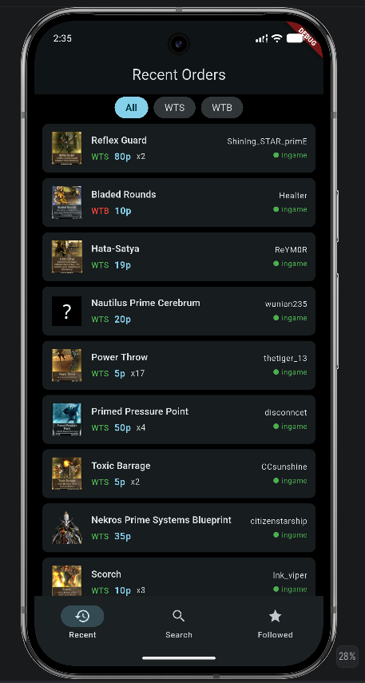
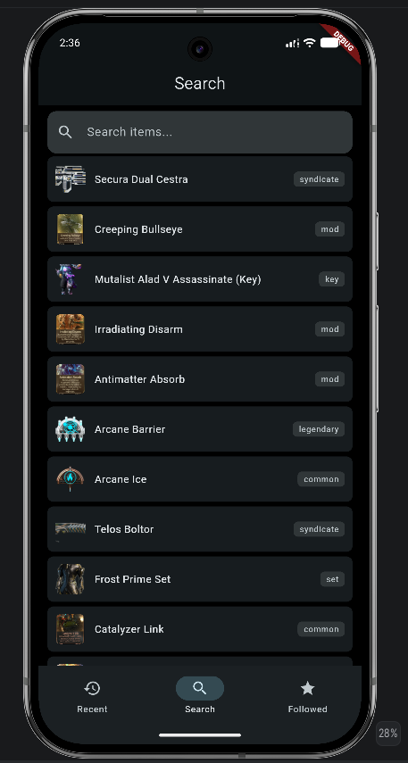
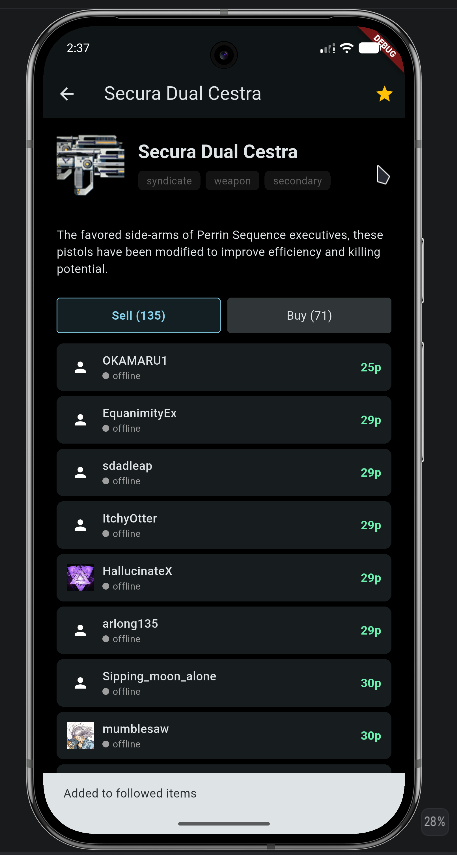
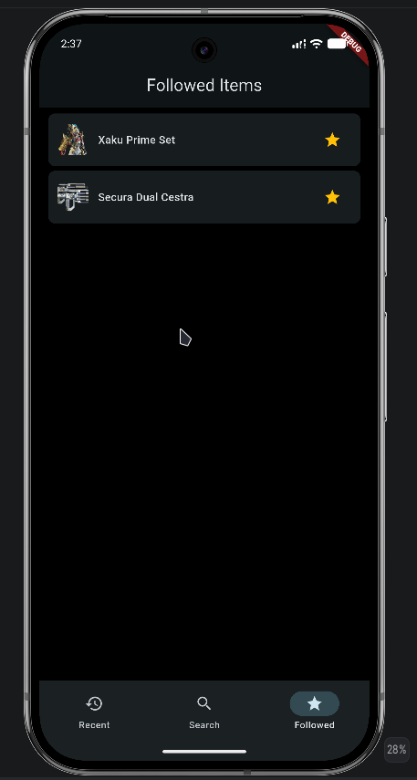

# mobileframe

dead simple unofficial mobile client to view warframe.market listings, made for university purposes

the app allows the user to see recently placed orders off the market.
the app fetches data through the api, saving certain bits in a hive database, for offline usage.
you can also search for a specific item if you have one in mind.
clicking on an item allows you to see a detailed view.
you can select items you wish to follow, having a separate tab that displays all of them live.

the app has been tested on android and linux, other implementations have not been looked at.

a few screenshots can be seen below:

i am not in any way shape or form associated with Digital Extremes or the devs behind warframe.market.

i am merely a fan, which had to make an assignment for university :)

please contact me if there's a problem with this project being public.